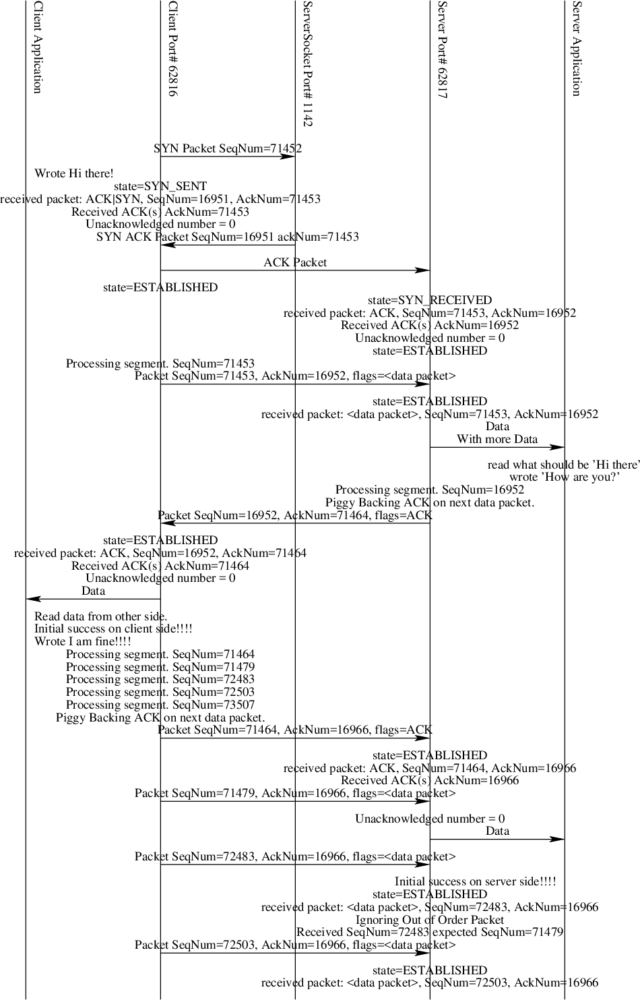

.. SRMS to Figs documentation master file, created by
   sphinx-quickstart on Sat Jan  4 09:01:20 2020.
   You can adapt this file completely to your liking, but it should at least
   contain the root `toctree` directive.

Welcome to SRMStoFigs!
========================================

.. toctree::
   :maxdepth: 2
   :caption: Contents:

SRMStoFigs is a tool for diagramming control flow within a complex system. It was originally written to pictorial show the flow of information and/or control within parallel programs where there is some degree of non-determinism. However, it can be used in deterministic systems as well.

The tool reads a simple DSL (domain specific language) and from that generates figures in pretty much any format that you care to generate. The tool generates *fig* files and, with the use of other tools, it can transform these fig files into PNG or PDF files or other formats. PNG and PDF conversion utilities are included.

Downloading and Dependencies
-------------------------------

You can down the tool from http://github.com/kentdlee/SRMStoFigs. Once downloaded you'll have to compile the source file. See the srmstofigs.cpp file for the compile command. You need to have a C++ compiler installed (like g++) to compile the code. It should compile with no warnings or errors.

Either place the directory containing the executables in your path or copy the executables to a directory in your path so you can run the program from anywhere.

To convert fig files to other formats you need to have additional tools installed. On a Mac OS X system you can use `Brew <https://brew.sh/>`_ to install *imagemagick*, *transfig*, and *gs* (i.e. ghostscript). If you are running on Linux then you can use your package manager to install these two packages. If you are running Windows you will need some kind of Unix environment installed to compile and run the dependent packages.

Running the Tool
-----------------

Once downloaded, compiled, and with the dependencies installed, you can run the tool on the example input file using.

.. code-block:: bash

    Kent's Mac> ls
    README.md	srms2pdf	srms2png	srmsexample	srmstofigs.cpp
    Kent's Mac> srms2png srmsexample
    isolation of a62816 requested
    Generating Output
    Converting srmsexample1 to PNG
    Converting srmsexample2 to PNG
    Converting srmsexample3 to PNG
    Converting srmsexample4 to PNG
    Converting srmsexample5 to PNG
    Converting srmsexample6 to PNG
    Kent's Mac> ls
    README.md		srmsexample		srmsexample3.png	srmsexample6.png
    srms2pdf		srmsexample1.png	srmsexample4.png	srmstofigs.cpp
    srms2png		srmsexample2.png	srmsexample5.png
    Kent's Mac>

Then you can open the srmsexample1.png through srmsexample6.png. On a Mac OS X system the srms2png will automatically open the pngs for your inspection.

Here is the first PNG from the example.

The Input Language
--------------------

The input to *SRMStoFigs* starts with two dimensions given in inches. This represents the size of figures to be produced from the tool. The flow diagrams
produced by the tool will be split into figures that adhere to this dimension size.

Next, after the *begin components* the components that are to appear across the top of the page are given. Each component consists of an identifier, like *a62816* and a name to be included in the diagram in double quotes. When referring to the component later in the input file, only the identifier is used.

The *end;* ends the components section. The rest of the file contains a series of commands which generally represent Send/Receive Messages or other data flow within the software system being diagrammed. The rest of the file contains commands that draw text and arrows that show the data/control flow of the system. The allowed commands are given in the next section.

.. code-block:: text

    8 10
    begin components
    a62816 "Client Application"
    p62816 "Client Port# 62816"
    p1142 "ServerSocket Port# 1142"
    end;
    isolate a62816
    p62816 p1142 "SYN Packet SeqNum=71452";
    ltext@ a62816 "Wrote Hi there!";
    component p62817 "Server Port# 62817";
    component a62817 "Server Application";
    ctext@ p62816 "state=SYN_SENT";
    ctext@ p62816 "received packet: ACK|SYN, SeqNum=16951, AckNum=71453";
    ctext@ p62816 "Received ACK(s) AckNum=71453";
    ctext@ p62816 "Unacknowledged number = 0";
    p1142 p62816 "SYN ACK Packet SeqNum=16951 ackNum=71453";
    p62816 p62817 "ACK Packet";

The Diagramming Commands
---------------------------

As seen above, each component consists of a vertical line in the figures that result from running the tool. The commands refer to these component identifiers (CIDs) in their descriptions below.

Input lines are generally terminated with a semicolon. Semicolons are not insignificant. The are used to advance the vertical position of the next command
within the figure. Without a semicolon, multiple commands will write to the same vertical position within the figure.

.. function:: component CID "Name in Figure"

    Add an additional component that wasn't known at the beginning of the
    input file. This can be useful when an input file to SRMStoFigs is
    automatically generated to show a specfic run/interaction of the code.

.. function:: CID1 CID2 "Text Describing Message"

    Draw an arrow from component *CID1* to component *CID2* showing the flow of information or control with the text inscribed just above the arrow.
    
.. function:: isolate CID

    Perform a transitive closure on messsages sent to and from the component *CID* with the diagram. Eliminate any components that don't interact with *CID* either directly for through the transitive closure to *CID*.

.. function:: ctext@ CID "Text Description"

    Position text centered in the vertical line associated with *CID*.

.. function:: ltext@ CID "Text Description"

    Position text left justified on the vertical line associated with *CID*.

.. function:: ltext@ CID "Text Description"

    Position text right justified on the vertical line associated with *CID*.

Complete Sample Input File
----------------------------

Here is the complete sample input file for SRMStoFigs.

.. code-block:: text

    8 10
    begin components
    a62816 "Client Application"
    p62816 "Client Port# 62816"
    p1142 "ServerSocket Port# 1142"
    end;
    isolate a62816
    p62816 p1142 "SYN Packet SeqNum=71452";
    ltext@ a62816 "Wrote Hi there!";
    component p62817 "Server Port# 62817";
    component a62817 "Server Application";
    ctext@ p62816 "state=SYN_SENT";
    ctext@ p62816 "received packet: ACK|SYN, SeqNum=16951, AckNum=71453";
    ctext@ p62816 "Received ACK(s) AckNum=71453";
    ctext@ p62816 "Unacknowledged number = 0";
    p1142 p62816 "SYN ACK Packet SeqNum=16951 ackNum=71453";
    p62816 p62817 "ACK Packet";
    ctext@ p62816 "state=ESTABLISHED";
    ctext@ p62817 "state=SYN_RECEIVED";
    ctext@ p62817 "received packet: ACK, SeqNum=71453, AckNum=16952";
    ctext@ p62817 "Received ACK(s) AckNum=16952";
    ctext@ p62817 "Unacknowledged number = 0";
    ctext@ p62817 "state=ESTABLISHED";
    ctext@ p62816 "Processing segment. SeqNum=71453";
    p62816 p62817 "Packet SeqNum=71453, AckNum=16952, flags=<data packet>";
    ctext@ p62817 "state=ESTABLISHED";
    ctext@ p62817 "received packet: <data packet>, SeqNum=71453, AckNum=16952";
    p62817 a62817 "Data";
    ctext@ a62817 "read what should be 'Hi there'";
    ctext@ a62817 "wrote 'How are you?'";
    ctext@ p62817 "Processing segment. SeqNum=16952";
    ctext@ p62817 "Piggy Backing ACK on next data packet.";
    p62817 p62816 "Packet SeqNum=16952, AckNum=71464, flags=ACK";
    ctext@ p62816 "state=ESTABLISHED";
    ctext@ p62816 "received packet: ACK, SeqNum=16952, AckNum=71464";
    ctext@ p62816 "Received ACK(s) AckNum=71464";
    ctext@ p62816 "Unacknowledged number = 0";
    p62816 a62816 "Data";
    ltext@ a62816 "Read data from other side.";
    ltext@ a62816 "Initial success on client side!!!!";
    ltext@ a62816 "Wrote I am fine!!!!";
    ctext@ p62816 "Processing segment. SeqNum=71464";
    ctext@ p62816 "Processing segment. SeqNum=71479";
    ctext@ p62816 "Processing segment. SeqNum=72483";
    ctext@ p62816 "Processing segment. SeqNum=72503";
    ctext@ p62816 "Processing segment. SeqNum=73507";
    ctext@ p62816 "Piggy Backing ACK on next data packet.";
    p62816 p62817 "Packet SeqNum=71464, AckNum=16966, flags=ACK";
    ctext@ p62817 "state=ESTABLISHED";
    ctext@ p62817 "received packet: ACK, SeqNum=71464, AckNum=16966";
    ctext@ p62817 "Received ACK(s) AckNum=16966";
    p62816 p62817 "Packet SeqNum=71479, AckNum=16966, flags=<data packet>";
    ctext@ p62817 "Unacknowledged number = 0";
    p62817 a62817 "Data";
    p62816 p62817 "Packet SeqNum=72483, AckNum=16966, flags=<data packet>";
    rtext@ a62817 "Initial success on server side!!!!";
    ctext@ p62817 "state=ESTABLISHED";
    ctext@ p62817 "received packet: <data packet>, SeqNum=72483, AckNum=16966";
    ctext@ p62817 "Ignoring Out of Order Packet";
    ctext@ p62817 "Received SeqNum=72483 expected SeqNum=71479";
    p62816 p62817 "Packet SeqNum=72503, AckNum=16966, flags=<data packet>";
    ctext@ p62817 "state=ESTABLISHED";
    ctext@ p62817 "received packet: <data packet>, SeqNum=72503, AckNum=16966";
    ctext@ p62817 "Ignoring Out of Order Packet";
    ctext@ p62817 "Received SeqNum=72503 expected SeqNum=71479";
    p62817 p62816 "ACK Packet AckNum=71479";
    ctext@ p62816 "ACK Timer Triggered";
    p62816 p62817 "Resending Packet SeqNum=71464 flags=ACK";
    p62816 p62817 "Resending Packet SeqNum=71479 flags=<data packet>";
    p62816 p62817 "Resending Packet SeqNum=72483 flags=<data packet>";
    ctext@ p62817 "state=ESTABLISHED";
    ctext@ p62817 "received packet: ACK, SeqNum=71464, AckNum=16966";
    ctext@ p62817 "Received ACK(s) AckNum=16966";
    ctext@ p62817 "Unacknowledged number = 0";
    ctext@ p62817 "Ignoring Out of Order Packet";
    ctext@ p62817 "Received SeqNum=71464 expected SeqNum=71479";
    ctext@ p62817 "state=ESTABLISHED";
    ctext@ p62817 "received packet: <data packet>, SeqNum=71479, AckNum=16966";
    p62817 a62817 "Data";
    ctext@ p62817 "state=ESTABLISHED";
    ctext@ p62817 "received packet: <data packet>, SeqNum=72483, AckNum=16966";
    p62817 a62817 "Data";
    p62816 p62817 "Resending Packet SeqNum=72503 flags=<data packet>";
    ctext@ p62817 "state=ESTABLISHED";
    ctext@ p62817 "received packet: <data packet>, SeqNum=72503, AckNum=16966";
    p62817 a62817 "Data";
    p62817 p62816 "ACK Packet AckNum=73507";
    ctext@ p62816 "Received packet with error.";
    ctext@ p62816 "state=ESTABLISHED";
    ctext@ p62816 "received packet: ACK, SeqNum=16952, AckNum=71464";
    ctext@ p62816 "ACK Timer Triggered";
    p62816 p62817 "Resending Packet SeqNum=71464 flags=ACK";
    ctext@ p62817 "state=ESTABLISHED";
    p62816 p62817 "Resending Packet SeqNum=71479 flags=<data packet>";
    ctext@ p62817 "received packet: ACK, SeqNum=71464, AckNum=16966";
    p62816 p62817 "Resending Packet SeqNum=72483 flags=<data packet>";
    ctext@ p62817 "Received ACK(s) AckNum=16966";
    ctext@ p62817 "Unacknowledged number = 0";
    ctext@ p62817 "Ignoring Out of Order Packet";
    p62816 p62817 "Resending Packet SeqNum=72503 flags=<data packet>";
    ctext@ p62817 "Received SeqNum=71464 expected SeqNum=73507";
    ctext@ p62817 "state=ESTABLISHED";
    ctext@ p62817 "received packet: <data packet>, SeqNum=71479, AckNum=16966";
    ctext@ p62817 "Ignoring Out of Order Packet";
    ctext@ p62817 "Received SeqNum=71479 expected SeqNum=73507";
    ctext@ p62817 "state=ESTABLISHED";
    ctext@ p62817 "received packet: <data packet>, SeqNum=72483, AckNum=16966";
    ctext@ p62817 "Ignoring Out of Order Packet";
    ctext@ p62817 "Received SeqNum=72483 expected SeqNum=73507";
    ctext@ p62817 "state=ESTABLISHED";
    ctext@ p62817 "received packet: <data packet>, SeqNum=72503, AckNum=16966";
    ctext@ p62817 "Ignoring Out of Order Packet";
    ctext@ p62817 "Received SeqNum=72503 expected SeqNum=73507";
    p62817 p62816 "ACK Packet AckNum=73507";
    ctext@ p62816 "state=ESTABLISHED";
    ctext@ p62816 "received packet: ACK, SeqNum=16966, AckNum=73507";
    ctext@ p62816 "Received ACK(s) AckNum=73507";
    ctext@ p62816 "Unacknowledged number = 0";
    ctext@ p62816 "Processing segment. SeqNum=73527";
    ctext@ p62816 "Processing segment. SeqNum=74531";
    ctext@ p62816 "Processing segment. SeqNum=74551";
    ctext@ p62816 "Processing segment. SeqNum=75555";
    p62816 p62817 "Packet SeqNum=73507, AckNum=16966, flags=<data packet>";
    p62816 p62817 "Packet SeqNum=73527, AckNum=16966, flags=<data packet>";
    p62816 p62817 "Packet SeqNum=74531, AckNum=16966, flags=<data packet>";
    ctext@ p62817 "state=ESTABLISHED";
    p62816 p62817 "Packet SeqNum=74551, AckNum=16966, flags=<data packet>";
    ctext@ p62817 "received packet: <data packet>, SeqNum=74531, AckNum=16966";
    ctext@ p62817 "Ignoring Out of Order Packet";
    ctext@ p62817 "Received SeqNum=74531 expected SeqNum=73507";
    ctext@ p62817 "Received packet with error.";
    ctext@ p62817 "state=ESTABLISHED";
    ctext@ p62817 "received packet: <data packet>, SeqNum=74531, AckNum=16966";
    p62817 p62816 "ACK Packet AckNum=73507";
    ctext@ p62816 "state=ESTABLISHED";
    ctext@ p62816 "received packet: ACK, SeqNum=16966, AckNum=73507";
    ctext@ p62816 "Received ACK(s) AckNum=73507";
    ctext@ p62816 "Unacknowledged number = 4";
    ctext@ p62816 "ACK Timer Triggered";
    p62816 p62817 "Resending Packet SeqNum=73507 flags=<data packet>";
    p62816 p62817 "Resending Packet SeqNum=73527 flags=<data packet>";
    ctext@ p62817 "state=ESTABLISHED";
    p62816 p62817 "Resending Packet SeqNum=74531 flags=<data packet>";
    ctext@ p62817 "received packet: <data packet>, SeqNum=73507, AckNum=16966";
    p62817 a62817 "Data";
    p62816 p62817 "Resending Packet SeqNum=74551 flags=<data packet>";
    ctext@ p62817 "state=ESTABLISHED";
    ctext@ p62817 "received packet: <data packet>, SeqNum=73527, AckNum=16966";
    p62817 a62817 "Data";
    ctext@ p62817 "state=ESTABLISHED";
    ctext@ p62817 "received packet: <data packet>, SeqNum=74531, AckNum=16966";
    p62817 a62817 "Data";
    ctext@ p62817 "state=ESTABLISHED";
    ctext@ p62817 "received packet: <data packet>, SeqNum=74551, AckNum=16966";
    p62817 a62817 "Data";
    p62817 p62816 "ACK Packet AckNum=75555";
    ctext@ p62816 "state=ESTABLISHED";
    ctext@ p62816 "received packet: ACK, SeqNum=16966, AckNum=75555";
    ctext@ p62816 "Received ACK(s) AckNum=75555";
    ctext@ p62816 "Unacknowledged number = 0";
    ctext@ p62816 "Processing segment. SeqNum=75575";
    ctext@ p62816 "Processing segment. SeqNum=76579";
    ctext@ p62816 "Processing segment. SeqNum=76599";
    ctext@ p62816 "Processing segment. SeqNum=77603";
    p62816 p62817 "Packet SeqNum=75555, AckNum=16966, flags=<data packet>";
    ctext@ p62817 "Received packet with error.";
    p62816 p62817 "Packet SeqNum=75575, AckNum=16966, flags=<data packet>";
    ctext@ p62817 "state=ESTABLISHED";
    ctext@ p62817 "received packet: <data packet>, SeqNum=74551, AckNum=16966";
    p62816 p62817 "Packet SeqNum=76579, AckNum=16966, flags=<data packet>";
    ctext@ p62817 "state=ESTABLISHED";
    ctext@ p62817 "received packet: <data packet>, SeqNum=75575, AckNum=16966";
    ctext@ p62817 "Ignoring Out of Order Packet";
    ctext@ p62817 "Received SeqNum=75575 expected SeqNum=75555";
    p62816 p62817 "Packet SeqNum=76599, AckNum=16966, flags=<data packet>";
    ctext@ p62817 "state=ESTABLISHED";
    ctext@ p62817 "received packet: <data packet>, SeqNum=76579, AckNum=16966";
    ctext@ p62817 "Ignoring Out of Order Packet";
    ctext@ p62817 "Received SeqNum=76579 expected SeqNum=75555";
    ctext@ p62817 "Received packet with error.";
    ctext@ p62817 "state=ESTABLISHED";
    ctext@ p62817 "received packet: <data packet>, SeqNum=76579, AckNum=16966";
    p62817 p62816 "ACK Packet AckNum=75555";
    ctext@ p62816 "state=ESTABLISHED";
    ctext@ p62816 "received packet: ACK, SeqNum=16966, AckNum=75555";
    ctext@ p62816 "Received ACK(s) AckNum=75555";
    ctext@ p62816 "Unacknowledged number = 4";
    ctext@ p62816 "ACK Timer Triggered";
    p62816 p62817 "Resending Packet SeqNum=75555 flags=<data packet>";
    p62816 p62817 "Resending Packet SeqNum=75575 flags=<data packet>";
    p62816 p62817 "Resending Packet SeqNum=76579 flags=<data packet>";
    p62816 p62817 "Resending Packet SeqNum=76599 flags=<data packet>";
    ctext@ p62817 "state=ESTABLISHED";
    ctext@ p62817 "received packet: <data packet>, SeqNum=75555, AckNum=16966";
    p62817 a62817 "Data";
    ctext@ p62817 "state=ESTABLISHED";
    ctext@ p62817 "received packet: <data packet>, SeqNum=75575, AckNum=16966";
    p62817 a62817 "Data";
    ctext@ p62817 "state=ESTABLISHED";
    ctext@ p62817 "received packet: <data packet>, SeqNum=76579, AckNum=16966";
    p62817 a62817 "Data";
    ctext@ p62817 "state=ESTABLISHED";
    ctext@ p62817 "received packet: <data packet>, SeqNum=76599, AckNum=16966";
    p62817 a62817 "Data";
    p62817 p62816 "ACK Packet AckNum=77603";
    ctext@ p62816 "state=ESTABLISHED";
    ctext@ p62816 "received packet: ACK, SeqNum=16966, AckNum=77603";
    ctext@ p62816 "Received ACK(s) AckNum=77603";
    ctext@ p62816 "Unacknowledged number = 0";
    ctext@ p62816 "Processing segment. SeqNum=77623";
    ctext@ p62816 "Processing segment. SeqNum=78627";
    ltext@ a62816 "The independence.txt file has been read and sent.";
    ctext@ p62816 "Processing segment. SeqNum=78647";
    ctext@ p62816 "End of input stream reached.";
    ctext@ p62816 "Reader Thread has exited.";
    p62816 p62817 "Packet SeqNum=77603, AckNum=16966, flags=<data packet>";
    p62816 p62817 "Packet SeqNum=77623, AckNum=16966, flags=<data packet>";
    ctext@ p62817 "state=ESTABLISHED";
    ctext@ p62817 "received packet: <data packet>, SeqNum=77603, AckNum=16966";
    p62816 p62817 "Packet SeqNum=78627, AckNum=16966, flags=<data packet>";
    p62817 a62817 "Data";
    p62816 p62817 "Packet SeqNum=78647, AckNum=16966, flags=<data packet>";
    ctext@ p62817 "state=ESTABLISHED";
    ctext@ p62817 "received packet: <data packet>, SeqNum=77623, AckNum=16966";
    p62817 a62817 "Data";
    ctext@ p62817 "Received packet with error.";
    ctext@ p62817 "state=ESTABLISHED";
    ctext@ p62817 "received packet: <data packet>, SeqNum=77623, AckNum=16966";
    p62817 p62816 "ACK Packet AckNum=78627";
    ctext@ p62816 "state=ESTABLISHED";
    ctext@ p62816 "received packet: ACK, SeqNum=16966, AckNum=78627";
    ctext@ p62816 "Received ACK(s) AckNum=78627";
    ctext@ p62816 "Unacknowledged number = 2";
    ctext@ p62816 "Entering state FIN_WAIT_1";
    p62816 p62817 "Packet SeqNum=79536, AckNum=16966, flags=FIN";
    ctext@ p62817 "Received packet with error.";
    ctext@ p62817 "state=ESTABLISHED";
    ctext@ p62817 "received packet: <data packet>, SeqNum=77623, AckNum=16966";
    ctext@ p62816 "ACK Timer Triggered";
    p62816 p62817 "Resending Packet SeqNum=78627 flags=<data packet>";
    p62816 p62817 "Resending Packet SeqNum=78647 flags=<data packet>";
    ctext@ p62817 "state=ESTABLISHED";
    p62816 p62817 "Resending Packet SeqNum=79536 flags=FIN";
    ctext@ p62817 "received packet: <data packet>, SeqNum=78627, AckNum=16966";
    p62817 a62817 "Data";
    ctext@ p62817 "state=ESTABLISHED";
    ctext@ p62817 "received packet: <data packet>, SeqNum=78647, AckNum=16966";
    p62817 a62817 "Data";
    ctext@ p62817 "state=ESTABLISHED";
    ctext@ p62817 "received packet: FIN, SeqNum=79536, AckNum=16966";
    rtext@ a62817 "Finished copying independence.txt to copy.txt";
    ctext@ p62817 "Piggy Backing ACK on next data packet.";
    p62817 p62816 "Packet SeqNum=16966, AckNum=79536, flags=ACK";
    ctext@ p62817 "Connection State is now LAST_ACK";
    p62817 p62816 "Packet SeqNum=16966, AckNum=79536, flags=FIN";
    ctext@ p62816 "state=FIN_WAIT_1";
    ctext@ p62816 "received packet: ACK, SeqNum=16966, AckNum=79536";
    ctext@ p62816 "Received ACK(s) AckNum=79536";
    ctext@ p62816 "Unacknowledged number = 1";
    ctext@ p62816 "Received packet with error.";
    ctext@ p62816 "state=FIN_WAIT_2";
    ctext@ p62816 "received packet: ACK, SeqNum=16966, AckNum=79536";
    ctext@ p62816 "ACK Timer Triggered";
    p62816 p62817 "Resending Packet SeqNum=79536 flags=FIN";
    ctext@ p62817 "state=LAST_ACK";
    ctext@ p62817 "received packet: FIN, SeqNum=79536, AckNum=16966";
    ctext@ p62817 "ACK Timer Triggered";
    p62817 p62816 "Resending Packet SeqNum=16966 flags=ACK";
    p62817 p62816 "Resending Packet SeqNum=16966 flags=FIN";
    ctext@ p62816 "state=FIN_WAIT_2";
    ctext@ p62816 "received packet: ACK, SeqNum=16966, AckNum=79536";
    ctext@ p62816 "Received ACK(s) AckNum=79536";
    ctext@ p62816 "Unacknowledged number = 1";
    ctext@ p62816 "state=FIN_WAIT_2";
    ctext@ p62816 "received packet: FIN, SeqNum=16966, AckNum=79536";
    p62816 p62817 "ACK Packet";
    ctext@ p62817 "state=LAST_ACK";
    ctext@ p62817 "received packet: ACK, SeqNum=79536, AckNum=16966";
    ctext@ p62817 "Received ACK(s) AckNum=16966";
    ctext@ p62817 "Unacknowledged number = 2";
    ctext@ p62817 "Quitting Receive Thread from LAST_ACK.";
    ctext@ p62817 "Sender Thread has exited.";
    ctext@ p62816 "ACK Timer Triggered";
    p62816 p62817 "Resending Packet SeqNum=79536 flags=FIN";
    ctext@ p62817 "ACK Timer Triggered";
    p62817 p62816 "Resending Packet SeqNum=16966 flags=ACK";
    p62817 p62816 "Resending Packet SeqNum=16966 flags=FIN";
    ctext@ p62816 "state=TIME_WAIT";
    ctext@ p62816 "received packet: ACK, SeqNum=16966, AckNum=79536";
    ctext@ p62816 "Received ACK(s) AckNum=79536";
    ctext@ p62816 "Unacknowledged number = 1";
    p62816 p62817 "ACK Packet sent again from TIME_WAIT state.";
    ctext@ p62816 "Sender Thread has exited.";

Indices and tables
==================

* :ref:`genindex`
* :ref:`modindex`
* :ref:`search`
